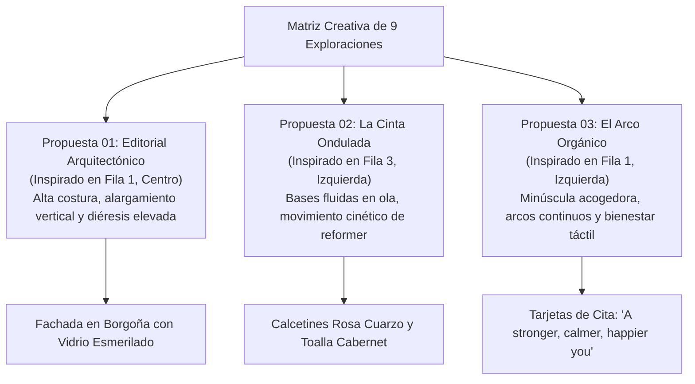

# MANUAL DE IDENTIDAD Y ESTRATEGIA DE MARCA
## NAÏA PILATES STUDIO — EDICIÓN CABERNET & ROSE QUARTZ
**Lema de Firma:** *"A stronger, calmer, happier you"* / *"Más fuerte, más serena, más feliz"*

---

## 1. Concepto y Curaduría Gráfica

A partir de la matriz de exploración gráfica inicial (tablero 3x3 sobre fondo borgoña con relieves en rosa cuarzo), se curaron y desarrollaron tres propuestas definitivas que responden a tres perfiles estratégicos de estudio:



### Las Tres Propuestas Curadas:
1. **Propuesta 01: Editorial Arquitectónico (*Alta Costura*)**:
   - Mayúscula *NAÏA* con proporción ultra-esbelta. El asta central se corona con dos esferas de diéresis elevadas y una cintura alta en la letra 'A'.
   - Sensación: Exclusividad, prestigio editorial (Vogue/Architectural Digest), elongación axial.
2. **Propuesta 02: La Cinta Ondulada (*Cinta Fluida*)**:
   - Mayúscula *NAÏA* con terminaciones y travesaño ondulados en cinta continua, representando el flujo del agua pura (*Náyades*) y el dinamismo del carro del reformer.
   - Sensación: Fluidez, ligereza, dinamismo controlado y gracia cinética.
3. **Propuesta 03: El Arco Orgánico (*Minúscula Acogedora*)**:
   - Minúscula continua *naïa* de trazos redondeados y amables. Arco continuo en la 'n' y cuencos circulares en las 'a'.
   - Sensación: Calidez, hospitalidad táctil, santuario de bienestar accesible y moderno.

---

## 2. Sistema Cromático de Firma: Cabernet & Rose Quartz

Inspirado exactamente en la paleta del tablero de referencia:

```
┌────────────────────────────────────────────────────────────────────────┐
│               SISTEMA DE COLOR: CABERNET & ROSE QUARTZ                 │
├────────────────────────────────────────────────────────────────────────┤
│ • Cabernet Profundo (Fondo / Primario):                                │
│   HEX #461E22 | RGB(70, 30, 34)    | CMYK(45,85,65,55) | Pantone 4975 C│
│ • Terracota Vino (Contraste / Plintos):                                │
│   HEX #522428 | RGB(82, 36, 40)    | CMYK(40,80,60,45) | Pantone 7645 C│
│ • Cuarzo Rosa Suave (Tipografía / Acento):                             │
│   HEX #F2B8B5 | RGB(242, 184, 181) | CMYK(2,30,20,0)   | Pantone 503 C │
│ • Rosa Pálido Luz (Brillos / Relieves):                                │
│   HEX #FCE1DF | RGB(252, 225, 223) | CMYK(0,12,8,0)    | Pantone 705 C │
│ • Oro Rosa / Bronce Rosado (Herrajes y Pan de Oro):                    │
│   HEX #C98D83 | RGB(201, 141, 131) | CMYK(15,50,45,10) | Pantone 4995 C│
│ • Alabastro Calcuta (Piedra y Papel Texturizado):                      │
│   HEX #FBF8F5 | RGB(251, 248, 245) | CMYK(1,1,2,0)     | Blanco Cálido │
└────────────────────────────────────────────────────────────────────────┘
```

---

## 3. Lema de Marca y Pautas de Aplicación

### Lema Oficial:
> *"A stronger, calmer, happier you"*  
> *(Adaptación: "Más fuerte, más serena, más feliz")*

### Reglas de Uso del Lema:
- Se aplica en tarjetas de citas de los alumnos, reverso de tarjetas de bienvenida, cintas de cuero para toallas de reformer y pie de página en redes sociales.
- Tipografía del lema: *Playfair Display* o *Cormorant Garamond* en versalitas (small caps) con espaciado amplio (`letter-spacing: 0.25em`).

---

## 4. Pautas Espaciales y Materiales del Estudio

1. **Fachada y Entrada**:
   - Molduras exteriores y carpintería de madera lacadas en **Cabernet Profundo (#461E22)**.
   - Vidrio con franjas esmeriladas translúcidas y tipografía 'NAÏA' en pan de oro rosa o vinilo en tono **Rose Quartz (#F2B8B5)**.
2. **Sala de Reformers**:
   - Estructuras de reformer en madera de roble claro o bases de piedra caliza/travertino.
   - Tapizados de los carros y hombreras en cuero vegano **Rosa Cuarzo Cálido**.
3. **Merchandising Retail**:
   - Calcetines de agarre antideslizante en tejido de tricot rosa con puntos de silicona borgoña.
   - Toallas de nido de abeja en borgoña oscuro con abrazadera de piel vegetal grabada con 'NAÏA'.
   - Botellas de agua en cerámica o cristal esmerilado con tapón de madera natural.
