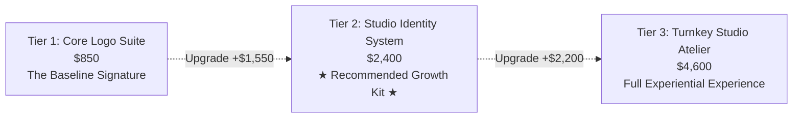
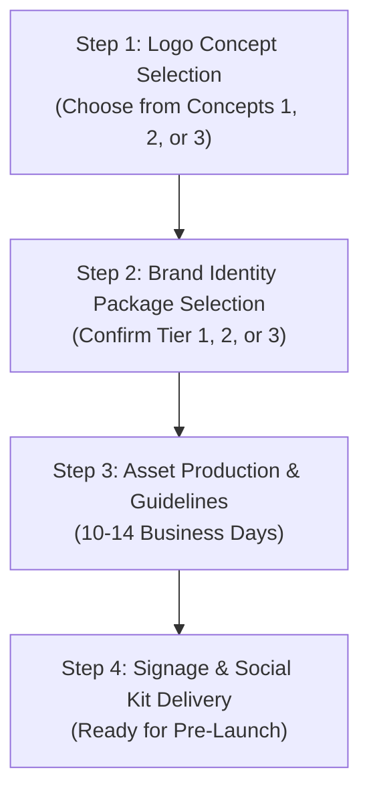

# BRAND PROPOSAL & INVESTMENT GUIDE
## NAÏA PILATES STUDIO
**Prepared For:** Leadership Team, Naïa Pilates Studio  
**Project:** Brand Identity & Visual System  
**Date:** October 2026  
**Document Version:** 1.0 (Confidential)

---

## 1. Executive Summary

In the premium boutique wellness industry, client acquisition and retention are driven by sensory confidence and brand perception. Clients do not simply purchase 50-minute reformer sessions; they invest in a sanctuary of poise, physical transformation, and mindful restoration.

While a logo mark serves as the signature of your studio, an **integrated Brand Identity System** is the visual and emotional engine that transforms a room with reformers into a coveted destination that commands $35–$45+ per drop-in class and $240–$320+ monthly memberships.

This document outlines:
1. **The Three Conceptual Brand Directions** created for **Naïa Pilates Studio**.
2. **Three Structured Investment Tiers** (ranging from core mark essentials to a turnkey studio launch atelier).
3. **The Studio ROI Model**, illustrating how a cohesive identity system generates immediate retail revenue and accelerates studio break-even.

---

## 2. The Naïa Pilates Studio Brand Opportunity

### The Name & Essence
* **Etymology**: Derived from the Greek *Naiad* (divine nymphs inhabiting freshwater springs and flowing streams—symbols of renewal, fluid motion, and life force) and the Basque *Naia* (wave, desire, free spirit).
* **The Pilates Connection**: Joseph Pilates founded *Contrology* on the principles of **Breath, Centering, Concentration, Control, Precision, and Flow**. Naïa embodies the union between fluid biomechanics and core stability.

### The Problem With a "Logo in Isolation"
When a boutique studio opens with only an isolated logo file:
* **Inconsistent Studio Touchpoints**: Interior sign makers, web developers, window vinyl installers, and printers each choose random fonts and mismatched shades of cream, sage, or gold.
* **Lost Retail Merchandising Revenue**: High-margin studio merchandise (branded grip socks, reformer towels, water bottles) requires dedicated production-ready patterns, vector submarks, and print specs.
* **Lower Perceived Value**: Without polished social media templates, member onboarding packs, and curated typography, potential members perceive the studio as an unproven generic gym rather than an exclusive boutique wellness brand.

---

## 3. Scope of Work: Three Investment Packages



### Tier 1: The Core Logo Suite
*Investment: **$850***  
*Best for: A bare-minimum start for businesses with existing in-house design capabilities.*

**What's Included:**
- Primary Logo Mark (Full Lockup)
- Secondary Logo / Stacked Version
- Minimal Submark / Monogram (Favicon & Social Avatar)
- Primary Color Palette (HEX, RGB, CMYK codes)
- Standard Vector & Raster Export Pack (.SVG, .EPS, .PNG, .PDF, .AI)
- Single-page Quick Reference Sheet (Logo Clear Space & Minimum Sizing)

---

### Tier 2: The Boutique Studio Identity System *(Recommended Upsell)*
*Investment: **$2,400*** *(or 2 milestone payments of $1,200)*  
*Best for: Opening a premier boutique pilates studio with an unmistakable, cohesive aesthetic that commands premium membership rates from Day 1.*

**What's Included (Everything in Tier 1, PLUS):**
- **Comprehensive Brand Style Guidelines (24-Page Brand Book)**
  - Typographic Hierarchy & Commercial Font Licensing guidance (Display, Body, Accent)
  - Secondary & Sensory Color System (Primary, Accent, Backgrounds, Linen/Paper swatches)
  - Logo Misuse & Grid Alignment Rules
  - Photographic Art Direction & Lighting Guidelines
- **Studio Collateral & Stationery Suite**
  - Luxury Appointment & Class Schedule Card (print-ready with embossing specs)
  - Studio Client Welcome / Liability Waiver Header & Template
  - Branded Studio Gift Certificate / Digital Pass Voucher
- **Social Media & Digital Launch Kit**
  - 12 Editable Canva / Figma Launch Templates (Class spotlight, Instructor intro, Testimonial, Schedule announcement)
  - 6 Instagram Story Highlight Covers
  - Email Newsletter Header & Signature Suite
- **Merchandise & Apparel Starter Kit**
  - Grip Sock Production Art (top embroidery + non-slip sole silicone dot pattern)
  - Reformer Micro-Fiber Towel & Mat Strap artwork specs
  - Frosted Water Bottle & Canvas Tote Bag print-ready vectors

---

### Tier 3: The Turnkey Studio Atelier *(Full Experience)*
*Investment: **$4,600*** *(or 3 milestone payments of $1,533)*  
*Best for: Multi-reformer studios seeking complete environmental branding, exterior signage specs, retail merchandising, and seamless member onboarding.*

**What's Included (Everything in Tiers 1 & 2, PLUS):**
- **Spatial & Environmental Signage Architecture**
  - Exterior Studio Glass & Window Vinyl Specs (Frosted scale drawings & gold foil measurements)
  - Interior Feature Wall 3D Logo Signage Specs (Cut metal, brushed bronze, backlit acrylic guidelines)
  - Wayfinding & Studio Zone Signage (Reformer Room, Restrooms, Private Studio, Lockers)
- **Comprehensive Retail Merchandising Pack**
  - Custom Apparel Label & Hangtag Design
  - Retail Packaging / Shopping Bag Specs
  - Reformer Grip Socks, Headrest Covers & Studio Hydration Flask specs
- **Member Experience & Onboarding System**
  - Luxury "First Class" New Member Welcome Brochure
  - Studio Membership VIP Card & Digital Apple Wallet Pass Design
  - Reformer Safety & Etiquette Plaque Design
- **Web & Booking Platform Art Direction**
  - Custom UI Style Guide for Mindbody / Momence / Mariana Tek / Acuity booking interfaces
  - Bespoke Studio Iconography Set (12 custom line icons: Reformer, Tower, Mat, Breath, Core, etc.)
  - Video Art Direction & Ambient Music Curation Playbook

---

## 4. Comprehensive Deliverables Comparison

| Feature / Deliverable | Tier 1: Logo Only ($850) | Tier 2: Studio Kit ($2,400) | Tier 3: Turnkey Atelier ($4,600) |
| :--- | :---: | :---: | :---: |
| **Primary Logo Lockup** | ✓ | ✓ | ✓ |
| **Secondary & Submark Monogram** | ✓ | ✓ | ✓ |
| **Master Vector Files (.SVG, .EPS, .AI, .PNG)** | ✓ | ✓ | ✓ |
| **Core Color Palette Codes** | ✓ (1-page) | ✓ (Full Book) | ✓ (Full Book) |
| **Complete Brand Style Guidelines** | — | ✓ (24 pages) | ✓ (40 pages) |
| **Commercial Typography Pairing** | — | ✓ | ✓ |
| **Stationery (Business/Appointment Cards)** | — | ✓ | ✓ |
| **Member Waiver & Intake Form Header** | — | ✓ | ✓ |
| **Social Media Launch Kit (12 Templates)** | — | ✓ | ✓ |
| **Story Highlight Icons & Email Header** | — | ✓ | ✓ |
| **Grip Sock & Merch Production Files** | — | ✓ | ✓ |
| **Exterior Frosted Glass & Signage Blueprints** | — | — | ✓ |
| **3D Interior Metal Wall Signage Blueprint** | — | — | ✓ |
| **Booking UI Styling (Mindbody/Momence)** | — | — | ✓ |
| **Bespoke 12-Piece Wellness Icon Set** | — | — | ✓ |
| **Member Welcome Folder & VIP Keycard** | — | — | ✓ |
| **Post-Launch Brand Consultation (30 Days)** | — | — | ✓ (Included) |

---

## 5. The Studio ROI: How the Identity Kit Pays for Itself

Investing in **Tier 2 ($2,400)** or **Tier 3 ($4,600)** is not a design expense; it is a direct revenue driver for a studio.

```
┌────────────────────────────────────────────────────────────────────────┐
│                        THE BOUTIQUE STUDIO MATH                        │
├────────────────────────────────────────────────────────────────────────┤
│ Average Class Drop-In Rate:         $38.00                             │
│ Average Monthly Unlimited Member:   $260.00 / month                    │
│ Average Studio Grip Sock Retail:    $22.00 ($6.50 cost = $15.50 profit)│
└────────────────────────────────────────────────────────────────────────┘
```

### Scenario A: Monthly Membership Lift
- A cohesive, luxurious brand perception typically increases trial-to-membership conversion by **15% to 25%**.
- **Just 3 new monthly members** paying $260/month generates **$780/month ($9,360/year)** in recurring revenue.
- *The entire Tier 2 investment ($2,400) is paid off in under 90 days.*

### Scenario B: Studio Retail Merchandising
- Every reformer pilates studio requires non-slip grip socks for hygiene and safety.
- Selling just **150 pairs of branded Naïa grip socks** at $22 ($15.50 profit margin) generates **$2,325 in net profit**.
- *Your retail socks alone pay for the entire brand identity system.*

---

## 6. Implementation Timeline & Next Steps



### Milestone Schedule:
1. **Logo Selection & Approval**: Day 1
2. **Typography, Color System & Brand Book Assembly**: Days 2–7
3. **Merchandise, Stationery & Social Suite Creation**: Days 8–12
4. **Final Sign-off & Delivery of Master Production Files**: Day 14

### How to Proceed:
Simply indicate which logo direction resonates best with your vision (**Concept 1: Fluid Core**, **Concept 2: Architectural Poise**, or **Concept 3: Vital Radiance**), and select your desired implementation package. We will immediately initiate your studio asset rollout.
