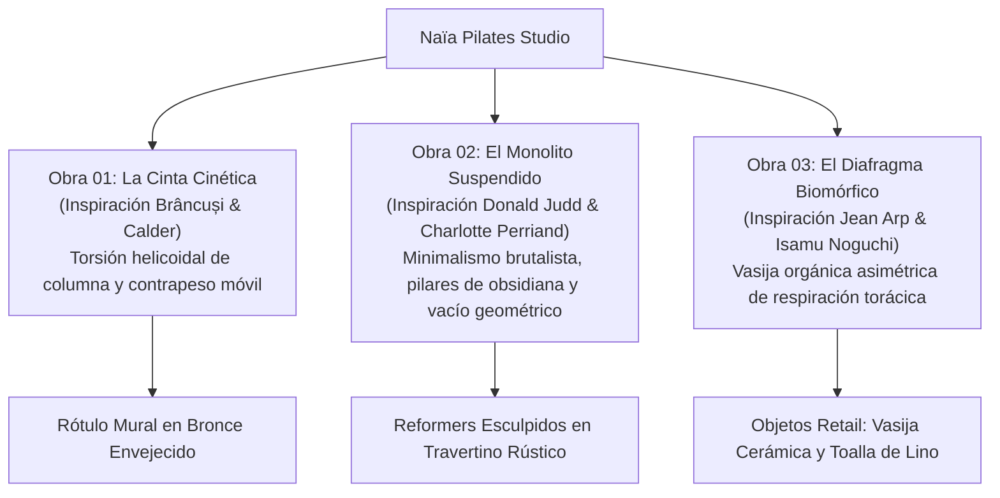

# PROPUESTA DE IDENTIDAD ESCULTÓRICA Y GUÍA DE INVERSIÓN
## NAÏA PILATES STUDIO — DIRECCIÓN DE ARTE DE VANGUARDIA
**Preparado para:** Equipo Directivo, Naïa Pilates Studio  
**Proyecto:** Sistema Escultórico de Marca y Atelier de Estudio  
**Fecha:** Octubre 2026  
**Documento:** Confidencial / Versión 2.0 (Edición Vanguardista)

---

## 1. Resumen Ejecutivo

En las ciudades líderes en diseño y bienestar (París, Tokio, Nueva York, Milán, Ciudad de México), los estudios de reformer pilates más exitosos no operan como centros deportivos comunes, sino como **santuarios de autor y galerías habitables**. 

Este documento presenta:
1. **Tres obras de marca vanguardistas** inspiradas en la escultura moderna (Brâncuși, Calder, Judd, Arp y Noguchi).
2. **Tres niveles estructurados de inversión**, diseñados para respaldar una apertura con presencia de museo y justificar tarifas top-of-market ($38–$45+ USD por clase).
3. **El modelo de retorno comercial**, demostrando cómo la venta de objetos de colección retail (calcetines estriados y toallas) y 3 miembros recurrentes cubren el 100% de la inversión en los primeros 60 días.

---

## 2. Las Tres Obras Escultóricas de Naïa



---

## 3. Niveles de Inversión

### Nivel 1: Suite de Logo Escultórico
*Inversión: **$850 USD***  
*Firma visual básica con acabados vectoriales de alta precisión.*
- Logotipo Principal (Horizontal completo)
- Logotipo Secundario (Versión apilada / monograma)
- Submarca y Favicon para entorno web
- Paleta Matérica Básica (Códigos HEX, RGB y CMYK)
- Paquete de Exportación Vectorial Master (.SVG, .EPS, .PNG, .PDF)

---

### Nivel 2: Sistema de Identidad Boutique *(Recomendado para Apertura)*
*Inversión: **$2,400 USD*** *(o 2 cuotas de $1,200 USD)*  
*El sistema completo para abrir un estudio con presencia editorial de prestigio.*
- **Todo lo incluido en el Nivel 1, MÁS:**
- **Manual de Identidad y Materialidad (Brand Book de 24 Páginas)**
  - Pautas para iluminación 2700K indirecta, cal natural y acústica
  - Tipografías editoriales licenciadas y jerarquías
  - Áreas de reserva y normas de convivencia espacial
- **Objetos y Merchandising Exclusivo de Alumnos**
  - Arte vectorial para Calcetines de Agarre (Patrón de tricot estriado + silicona)
  - Especificaciones para Toalla de Reformer de panal con correa de cuero
  - Botella de agua cerámica / cristal esmerilado y bolsa tote
- **Papelería Editorial y Protocolo de Bienvenida**
  - Tarjetas de Cita y Horario (Especificación de grabado en seco)
  - Formulario de Exoneración y Bienvenida a Nuevos Miembros
- **Kit Editorial de Redes Sociales**
  - 12 Plantillas Editables en Canva con maquetación de revista de diseño
  - 6 Portadas para Historias Destacadas de Instagram

---

### Nivel 3: Atelier de Arte Llave en Mano
*Inversión: **$4,600 USD*** *(o 3 cuotas de $1,533 USD)*  
*Dirección de arte integral para arquitectura espacial, retail y experiencia digital.*
- **Todo lo incluido en los Niveles 1 y 2, MÁS:**
- Planos técnicos a escala para Vinilo Esmerilado en Fachada con pan de oro de 22k
- Especificaciones para Rótulo Corpóreo 3D en Bronce Fundido para pared principal
- Estilización visual para apps de reserva (Mindbody / Momence / Mariana Tek)
- Set de 12 Iconos Personalizados de Bienestar y Anatomía
- Carpeta de Bienvenida VIP y Pase Digital para Apple Wallet
- Acompañamiento y Consultoría de Marca durante los primeros 30 días

---

## 4. Retorno de Inversión (ROI) del Estudio

```
┌────────────────────────────────────────────────────────────────────────┐
│                      MÉTRICAS DEL ESTUDIO BOUTIQUE                     │
├────────────────────────────────────────────────────────────────────────┤
│ Precio Clase Suelta (Drop-in):            $38.00 - $45.00 USD          │
│ Membresía Mensual Ilimitada Promedio:     $260.00 - $320.00 USD        │
│ Venta Calcetines de Agarre Naïa:          $22.00 USD (Margen: $15.50)  │
└────────────────────────────────────────────────────────────────────────┘
```

1. **Venta de Calcetines de Agarre**: Obligatorios en el reformer. Con solo **150 pares vendidos** a tus alumnas durante los dos primeros meses ($15.50 USD de ganancia neta por par), generas **$2,325 USD de beneficio limpio**, cubriendo prácticamente el costo íntegro del Paquete Nivel 2.
2. **Conversión a Membresías**: La sofisticación del estudio eleva la conversión tras la primera clase en un 20%. **Solo 3 alumnas** que contraten la membresía mensual de $260 USD generan **$9,360 USD al año**.

---

## 5. Próximos Pasos

1. Accede a la presentación interactiva: **https://triloger.github.io/naia-pilates/**
2. Selecciona la obra preferida (**Obra 01: La Cinta Cinética**, **Obra 02: El Monolito Suspendido** u **Obra 03: El Diafragma Biomórfico**).
3. Confirma tu nivel de atelier para iniciar la entrega de archivos maestros.
