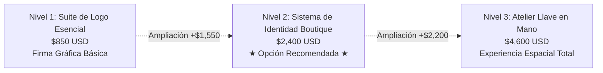

# PROPUESTA DE IDENTIDAD DE MARCA Y GUÍA DE INVERSIÓN
## NAÏA PILATES STUDIO
**Preparado para:** Equipo Directivo, Naïa Pilates Studio  
**Proyecto:** Sistema de Identidad Visual y Experiencia de Estudio  
**Fecha:** Octubre 2026  
**Versión:** 1.0 (Documento Confidencial)

---

## 1. Resumen Ejecutivo

En la industria del bienestar y el fitness boutique de alta gama, la captación y fidelización de miembros no se basan en el ejercicio físico aislado, sino en la **percepción de valor, la confianza estética y el estatus sensorial**. Un cliente no compra una sesión de 50 minutos en un reformer; invierte en un santuario de calma, transformación postural y restauración consciente.

Un logotipo aislado funciona como una firma, pero un **Sistema Integral de Identidad de Marca** es el motor visual y comercial que transforma un espacio con reformers en un destino exclusivo capaz de cobrar entre **$35 y $45+ por clase suelta (drop-in)** y membresías mensuales de **$240 a $320+**.

Este documento presenta:
1. **Las tres direcciones conceptuales** diseñadas exclusivamente para **Naïa Pilates Studio**.
2. **Tres niveles estructurados de inversión**, desde la suite básica de logos hasta el paquete atelier "llave en mano".
3. **El modelo de retorno de inversión (ROI)**, demostrando cómo la venta de mercancía exclusiva (calcetines antideslizantes) y 2 a 3 nuevos miembros cubren el 100% del proyecto en los primeros 60 días.

---

## 2. La Oportunidad de Marca para Naïa Pilates Studio

### Esencia y Etimología
* **Origen Mítico**: Del griego *Náyades* (ninfas divinas que custodian las fuentes y corrientes de agua pura, símbolos de renovación biológica, gracia y vitalidad fluida) y del vasco *Naia* (ola en movimiento, anhelo del alma y libertad).
* **Conexión con el Método Pilates**: Joseph Pilates basó la *Contrología* en seis principios esenciales: **Respiración, Centro (Powerhouse), Concentración, Control, Precisión y Fluidez**. Naïa representa la unión perfecta entre biomecánica orgánica y estabilidad postural.

### El Costo Oculto de "Solo Comprar un Logo"
Cuando un estudio boutique abre sus puertas únicamente con un archivo de logo aislado:
* **Inconsistencia Visual Inmediata**: El rotulista de la fachada, el diseñador web, el proveedor de uniformes y la imprenta eligen fuentes aleatorias y tonos desalineados de crema, dorado o verde salvia.
* **Pérdida de Ingresos por Merchandising**: La venta de productos de alto margen (calcetines con agarre de silicona, toallas de microfibra para reformer, botellas de agua) requiere matrices vectoriales listas para producción.
* **Percepción de Gimnasio Genérico**: Sin plantillas profesionales para redes sociales, manual de bienvenida y tipografía editorial, los clientes perciben el estudio como un negocio novato en lugar de un club boutique consolidado.

---

## 3. Paquetes de Inversión



### Nivel 1: Suite de Logo Esencial
*Inversión: **$850 USD***  
*Ideal para: Negocios que solo requieren la firma visual y ya cuentan con diseñadores internos.*

**Incluye:**
- Logotipo Principal (Versión horizontal completa)
- Logotipo Secundario (Versión vertical / apilada)
- Submarca y Monograma (Icono para redes sociales y favicon web)
- Paleta de Color Básica (Códigos HEX, RGB y CMYK)
- Paquete de Exportación Vectorial Master (.SVG, .EPS, .PNG transparente, .PDF)
- Ficha Técnica de Área de Protección y Tamaño Mínimo de Impresión

---

### Nivel 2: Sistema de Identidad de Estudio Boutique *(Recomendado)*
*Inversión: **$2,400 USD*** *(o 2 cuotas de $1,200 USD)*  
*Ideal para: Abrir un estudio de reformer pilates con una estética de lujo impecable que inspire confianza y justifique tarifas premium desde el día de apertura.*

**Incluye (Todo lo del Nivel 1, MÁS):**
- **Manual de Identidad de Marca Completo (Brand Book de 24 Páginas)**
  - Jerarquía Tipográfica y licencias recomendadas (Display, Textos, Acentos)
  - Sistema de Color Sensorial (Primarios, Secundarios, Fondos y Texturas de Lino/Piedra)
  - Normas de Uso Correcto e Incorrecto del Logotipo
  - Dirección de Arte Fotográfica (Iluminación y estilo para sesiones del estudio)
- **Papelería y Materiales Físicos para el Estudio**
  - Tarjetas de Citas y Horario de Clases (Listas para imprenta con especificaciones de grabado en seco)
  - Hoja de Exoneración / Formulario de Ingreso de Nuevos Clientes
  - Bono / Certificado de Regalo Exclusivo
- **Kit de Lanzamiento Digital y Redes Sociales**
  - 12 Plantillas Editables en Canva / Figma (Presentación de instructores, horarios, testimonios, promociones)
  - 6 Portadas para Historias Destacadas de Instagram
  - Cabecera y firma de correo electrónico profesional
- **Kit de Producción de Merchandising para Alumnos**
  - Arte vectorial para Calcetines de Agarre (Bordado superior + patrón de silicona antideslizante en la suela)
  - Especificaciones para Toalla de Reformer y correa de transporte
  - Diseño para Botella de Agua de Cristal Esmerilado y Bolsa Tote de Algodón Orgánico

---

### Nivel 3: Atelier de Estudio Llave en Mano *(Experiencia Total)*
*Inversión: **$4,600 USD*** *(o 3 cuotas de $1,533 USD)*  
*Ideal para: Estudios multiespacio que buscan señalización arquitectónica, planos de rotulación para fachada, merchandising retail y onboarding VIP.*

**Incluye (Todo lo de los Niveles 1 y 2, MÁS):**
- **Arquitectura de Señalética Espacial y Fachada**
  - Planos a escala para Vinilo Esmerilado en Vidrio de Fachada con detalles en pan de oro
  - Especificaciones para Rótulo Metálico Corpóreo 3D en Pared Principal (Corte láser en bronce / retroiluminación cálida)
  - Señalética Interior de Orientación (Sala de Reformers, Vestuarios, Zona Privada)
- **Colección Completa de Retail Merchandising**
  - Etiquetas colgantes de prendas y packaging para bolsas de compra
  - Especificaciones técnicas para tapizado personalizado de hombreras y cabezales de reformer
- **Sistema de Bienvenida y Experiencia de Membresía**
  - Carpeta de Bienvenida para el Primer Día de Clase
  - Tarjeta VIP de Membresía y Pase Digital para Apple Wallet
  - Placa de Protocolo y Seguridad en el Reformer
- **Dirección de Arte Digital y Plataformas de Reserva**
  - Guía de Estilo Visual para Mindbody / Momence / Mariana Tek / Acuity
  - Set de 12 Iconos Personalizados de Bienestar (Reformer, Torre, Mat, Respiración, Core, etc.)
  - Acompañamiento y Consultoría de Marca durante los primeros 30 días posteriores al lanzamiento

---

## 4. Tabla Comparativa de Entregables

| Entregable / Beneficio | Nivel 1: Solo Logo ($850) | Nivel 2: Sistema Boutique ($2,400) | Nivel 3: Atelier Llave en Mano ($4,600) |
| :--- | :---: | :---: | :---: |
| **Logotipo Principal Vectorial** | ✓ | ✓ | ✓ |
| **Submarca y Monograma** | ✓ | ✓ | ✓ |
| **Archivos Master (.SVG, .EPS, .PNG, .PDF)** | ✓ | ✓ | ✓ |
| **Códigos de Paleta de Color** | ✓ (1 pág.) | ✓ (Completo) | ✓ (Completo) |
| **Manual de Identidad de Marca (Brand Book)** | — | ✓ (24 págs.) | ✓ (40 págs.) |
| **Jerarquía y Licencias Tipográficas** | — | ✓ | ✓ |
| **Papelería (Tarjetas de Cita y Horarios)** | — | ✓ | ✓ |
| **Hoja de Exoneración y Bienvenida** | — | ✓ | ✓ |
| **Kit de 12 Plantillas de Redes Sociales (Canva)** | — | ✓ | ✓ |
| **Arte de Calcetines de Agarre y Toalla Reformer** | — | ✓ | ✓ |
| **Planos para Vinilo Esmerilado en Fachada** | — | — | ✓ |
| **Especificación de Rótulo Corpóreo 3D en Bronce** | — | — | ✓ |
| **Estilización de Plataforma de Reservas** | — | — | ✓ |
| **Set de 12 Iconos de Bienestar** | — | — | ✓ |
| **Pase Digital Apple Wallet y Tarjeta VIP** | — | — | ✓ |
| **Asesoría de Marca Post-Lanzamiento (30 días)** | — | — | ✓ (Incluida) |

---

## 5. El Retorno de Inversión (ROI) del Estudio

Elegir el **Nivel 2 ($2,400 USD)** no es un gasto decorativo; es una herramienta directa de facturación para el estudio:

```
┌────────────────────────────────────────────────────────────────────────┐
│                      MÉTRICAS DEL ESTUDIO BOUTIQUE                     │
├────────────────────────────────────────────────────────────────────────┤
│ Precio Promedio Clase Suelta (Drop-in):   $38 USD                      │
│ Membresía Mensual Ilimitada Promedio:     $260 USD / mes               │
│ Venta de Calcetín con Agarre Naïa:        $22 USD ($6.50 coste = $15.50 margen)│
└────────────────────────────────────────────────────────────────────────┘
```

### Escenario A: Calcetines de Agarre (Obligatorios en Reformer)
- Todo alumno nuevo que entra a una clase de reformer necesita calcetines antideslizantes por higiene y seguridad.
- Vendiendo solo **150 pares de calcetines con la marca Naïa** a $22 USD ($15.50 USD de beneficio neto por par), generas **$2,325 USD de ganancia limpia**.
- *La venta de calcetines en los primeros dos meses paga prácticamente todo el Sistema de Identidad.*

### Escenario B: Captación de Nuevos Miembros
- Un diseño coherente y sofisticado eleva la tasa de conversión de la clase de prueba a membresía mensual entre un **15% y un 25%**.
- **Solo 3 alumnos nuevos** que compren una membresía mensual de $260 USD generan **$9,360 USD al año**.
- *El paquete completo de Nivel 2 queda amortizado en menos de 90 días.*

---

## 6. Próximos Pasos

1. **Selección del Logotipo**: Elige la dirección que mejor represente tu visión (**Concepto 1: El Núcleo Fluido**, **Concepto 2: Aplomo Arquitectónico**, o **Concepto 3: Radiancia Vital**).
2. **Confirmación del Paquete**: Selecciona el nivel de inversión deseado (Nivel 1, 2 o 3).
3. **Inicio de Producción**: En un plazo de 10 a 14 días laborables recibirás todos los archivos finales listos para producción e imprenta.
